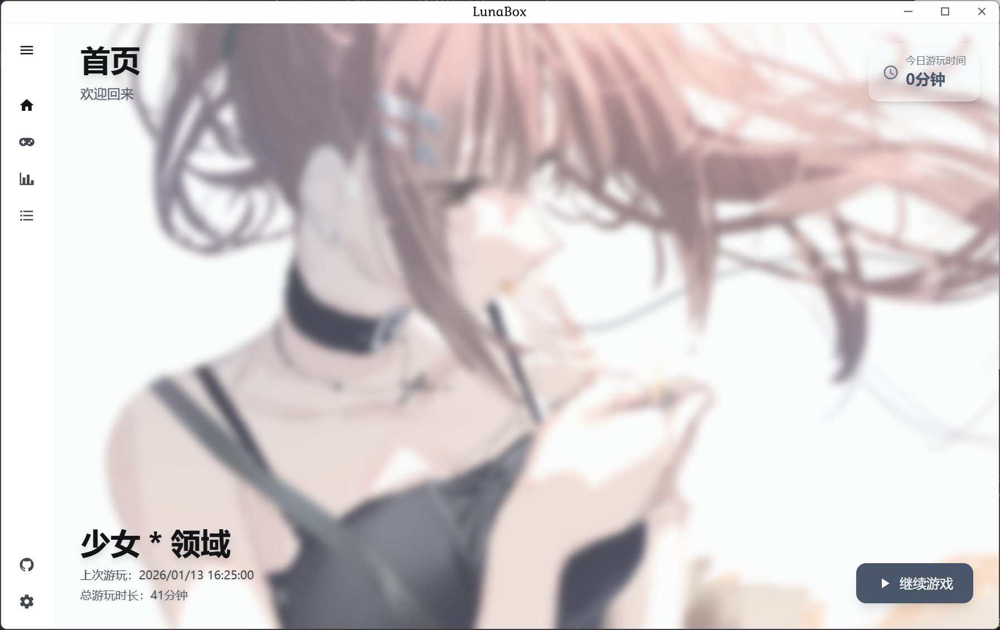
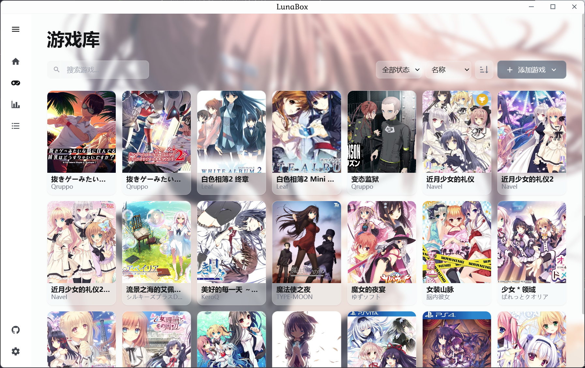
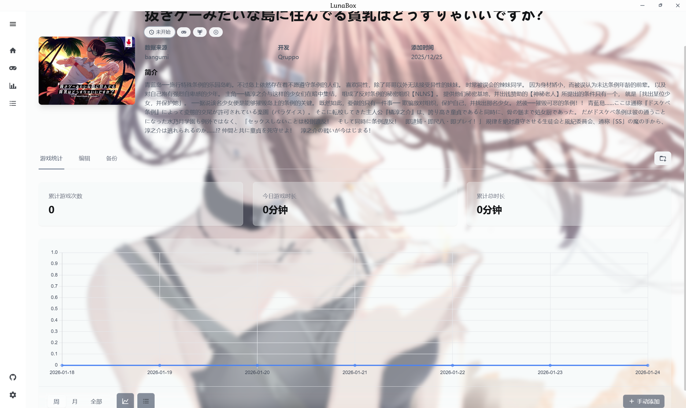
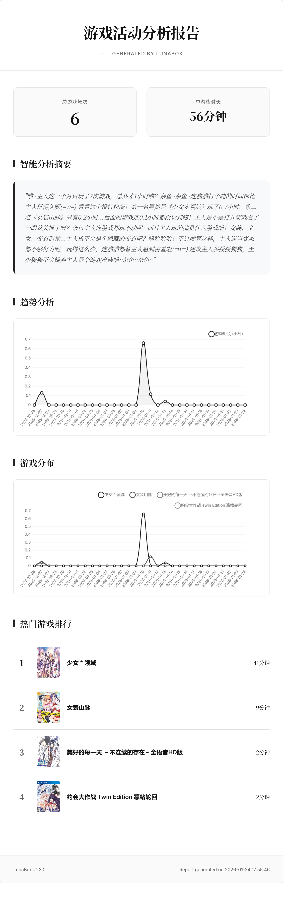
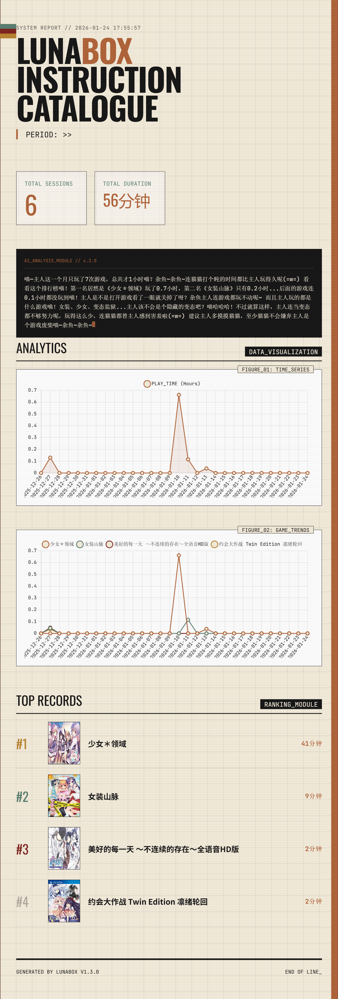
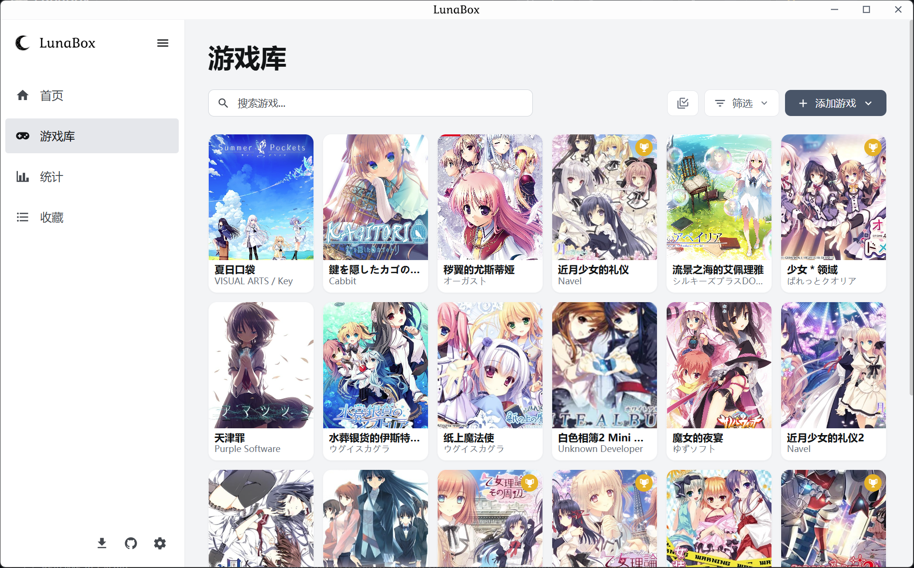
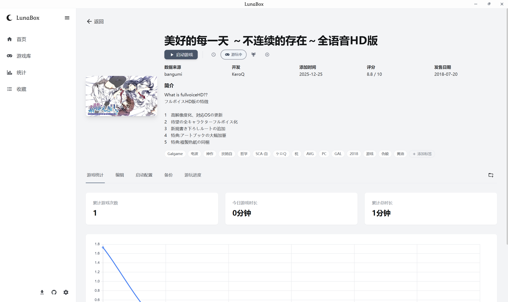

<div align="center">


# LunaBox

**Lightweight, fast, and feature-rich visual novel management and game statistics tool**

[中文](README.zh-CN.md) | [English](README.md) | [日本語](README.ja.md)

[](https://go.dev/)
[](https://wails.io/)
[](https://react.dev/)

</div>

## ✨ Features

- **Game category management** - Organize your library with custom categories
- **Playtime tracking** - Automatically track session time when launching games
- **Small binary footprint** - Built with Wails, no full browser runtime bundled
- **Multi-dimensional statistics** - View play data by day/week/month/year and export shareable stat cards
- **AI insights** - Generate personalized and fun reports based on your gameplay data
- **Convenient data import** - Import from PotatoVN, Playnite, and Vnite; supports folder batch import and drag-and-drop
- **Multi-channel backup** - Local backup, AWS S3, Qiniu, Alibaba Cloud OSS (S3-compatible), and OneDrive backup
- **Privacy and security** - All sensitive data is stored locally

## Screenshots

<details>
<summary>Click to view more custom background styles</summary>







</details>

<details>
<summary>Click to view stat export poster templates</summary>






</details>

Additional in-app screenshots (located in the `screenshot/` directory):






## 🛠️ Tech Stack

| Layer | Technology |
|------|------|
| **Framework** | [Wails v2](https://wails.io/) |
| **Backend** | [Go 1.24](https://go.dev/) |
| **Frontend** | [React 18](https://react.dev/) + [TypeScript](https://www.typescriptlang.org/) |
| **Database** | [DuckDB](https://duckdb.org/) |
| **Build Tool** | [Vite](https://vitejs.dev/) |
| **Styling** | [UnoCSS](https://unocss.dev/) |
| **Routing** | [TanStack Router](https://tanstack.com/router) |
| **State Management** | [Zustand](https://zustand-demo.pmnd.rs/) |
| **Charts** | [Chart.js](https://www.chartjs.org/) + [react-chartjs-2](https://react-chartjs-2.js.org/) |

## 📦 Installation

### Download from Releases

Go to the [Releases](https://github.com/Saramanda9988/LunaBox/releases) page and download the latest installer.

### Build from source

#### Prerequisites

- [Go 1.24+](https://go.dev/dl/)
- [Node.js 18+](https://nodejs.org/)
- [pnpm](https://pnpm.io/)
- [Wails CLI](https://wails.io/docs/gettingstarted/installation)
- [msys2](https://www.msys2.org/)

```bash
# Install Wails CLI
go install github.com/wailsapp/wails/v2/cmd/wails@latest
```

#### Build steps

```bash
# Clone project
git clone https://github.com/Saramanda9988/lunabox.git
cd lunabox

# Install frontend dependencies
cd frontend && pnpm install && cd ..

# Run in development mode
wails dev

# Build production version
wails build

# Build locally using script (Windows)
.\scripts\build.bat all 1.0.0-beta
```

## 🤝 Contributing

Issues and Pull Requests are welcome.

## 🗺️ Roadmap

- [x] Auto update check and notifications
- [x] Improved logging system
- [ ] Import data from ReinaManager
- [x] Custom background images
- [x] Better default home and homepage customization
- [x] i18n support
- [ ] Self-hosted Docker server
- [ ] IM platform bot plugin
- [ ] Better AI system: long-term memory + persona + external search
- [x] More stat export templates
- [x] Game launch support with Locale Emulator and other launch options

## 😀 Open Source Inspired by Open Source

Inspiration:

- [PotatoVN](https://github.com/GoldenPotato137/PotatoVN) - Galgame management tool
- [ReinaManager](https://github.com/huoshen80/ReinaManager) - Lightweight galgame and visual novel manager
- [Playnite](https://github.com/JosefNemec/Playnite) - An open source video game library manager with one simple goal: to provide a unified interface for all of your games
- [Vnite](https://github.com/ximu3/vnite) - A unified platform to organize your game collection, track gameplay, with real-time cloud sync across devices and detailed gameplay reports

## 🙏 Acknowledgements

Game metadata APIs:

- [Bangumi](https://github.com/bangumi) - Bangumi Project
- [VNDB](https://vndb.org/) - The Visual Novel Database
- [月幕gal](https://www.ymgal.games/) - A platform for visual novel metadata

Archive extraction support:

- [7-Zip](https://www.7-zip.org/) - A free and open-source file archiver utility

## 📄 License

This project is licensed under [AGPL v3](LICENSE).
