

[中文](README.zh-CN.md) | [English](README.md) | [日本語](README.ja.md)

  
  
  

  
  

## ✨ Features

- **Game category management** - Organize your library with custom categories
- **Playtime tracking** - Automatically track session time when launching games
- **Multi-dimensional statistics** - View play data by day/week/month/year and export shareable stat cards
- **AI insights** - Analyze gameplay data to generate personalized, playful reports, with MCP exposure and CLI skill support for broader data-use scenarios
- **Convenient data import** - Import from PotatoVN, Playnite, Vnite, and Steam; supports folder batch import and drag-and-drop
- **Backup and sync (beta)** - Local backup and multi-device sync, AWS S3, Qiniu, Alibaba Cloud OSS (S3-compatible), and OneDrive backup
- **CLI Mode** - Support for managing, launching, and backing up games, and modifying program data via command line
- **Privacy and security** - All sensitive data is stored locally

## 📷 Screenshots

Click to view more custom background styles

<table>
  <tr>
    <td width="50%" align="center">
      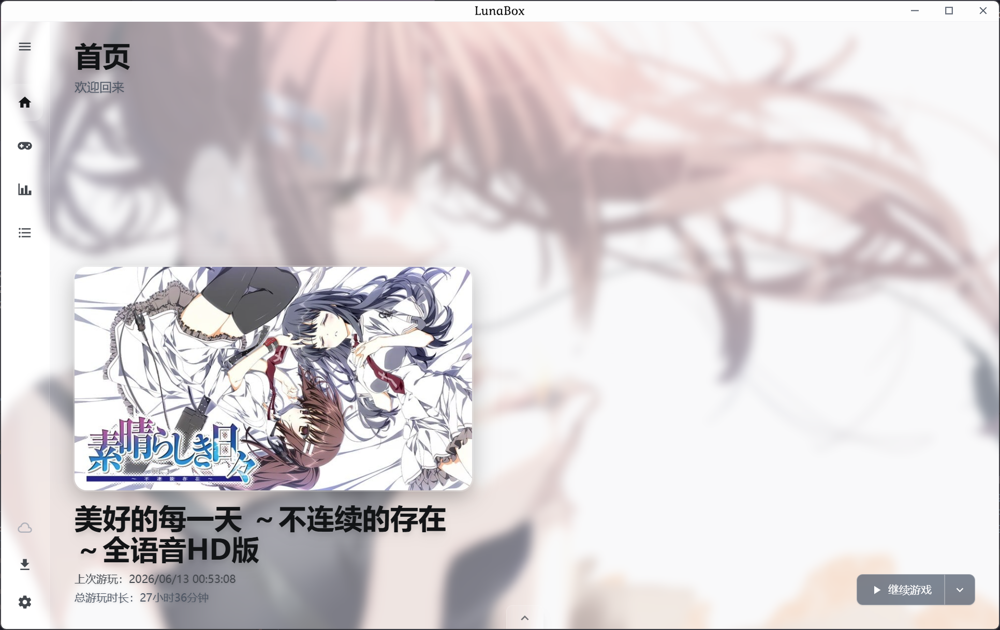
       
      Home
    </td>
    <td width="50%" align="center">
      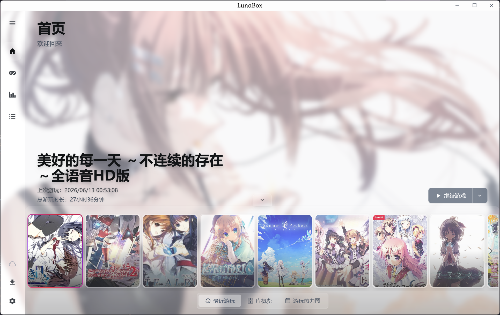
       
      Alternative Home
    </td>
  </tr>
  <tr>
    <td width="50%" align="center">
      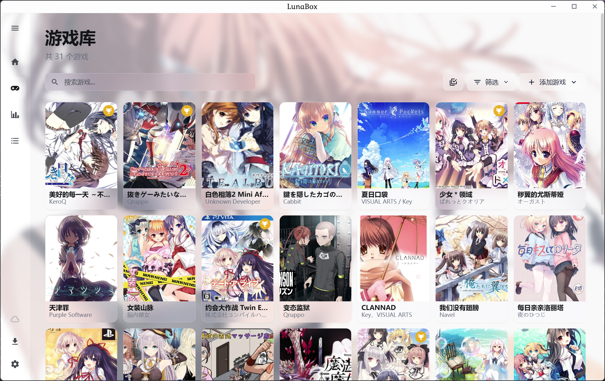
       
      Library
    </td>
    <td width="50%" align="center">
      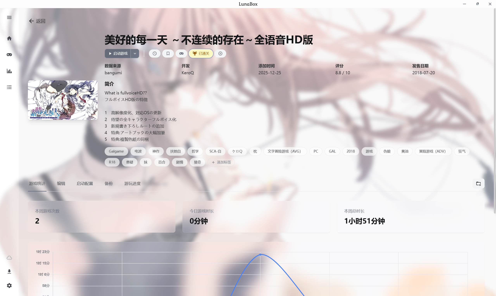
       
      Game Detail
    </td>
  </tr>
  <tr>
    <td colspan="2" align="center">
      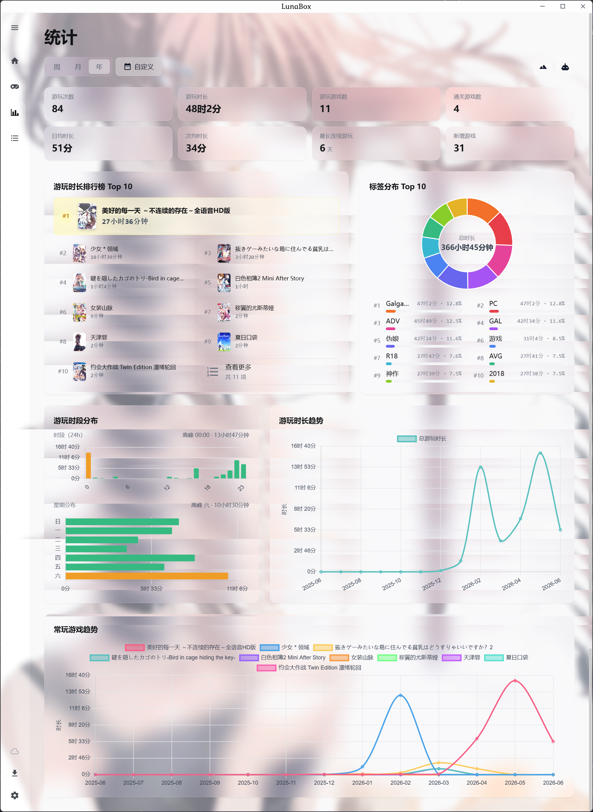
       
      Statistics
    </td>
  </tr>
</table>

Click to view stat export poster templates

<table>
  <tr>
    <td width="33%" align="center">
      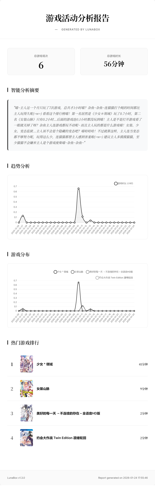
       
      Minimal
    </td>
    <td width="33%" align="center">
      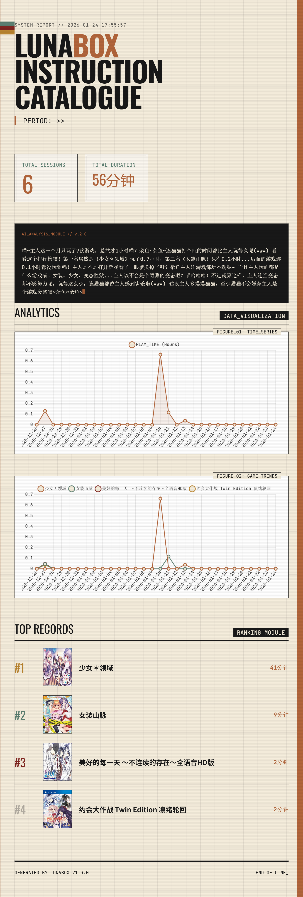
       
      Future Retro
    </td>
    <td width="33%" align="center">
      
       
      Journal Style
    </td>
  </tr>
</table>

Additional in-app screenshots (located in the `screenshot/` directory):

<table>
  <tr>
    <td width="50%" align="center">
      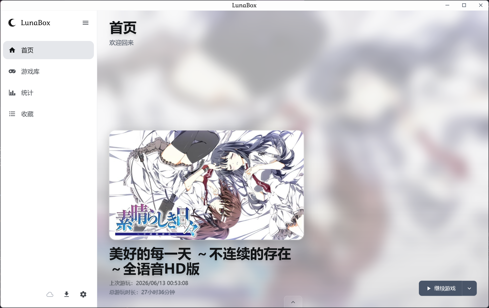
       
      Home
    </td>
    <td width="50%" align="center">
      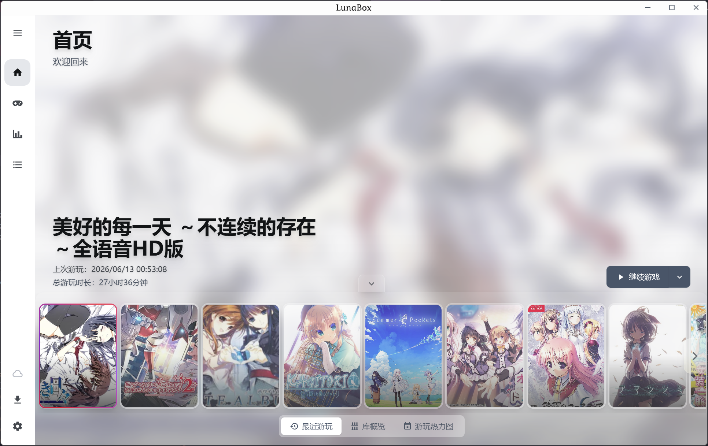
       
      Alternative Home
    </td>
  </tr>
  <tr>
    <td width="50%" align="center">
      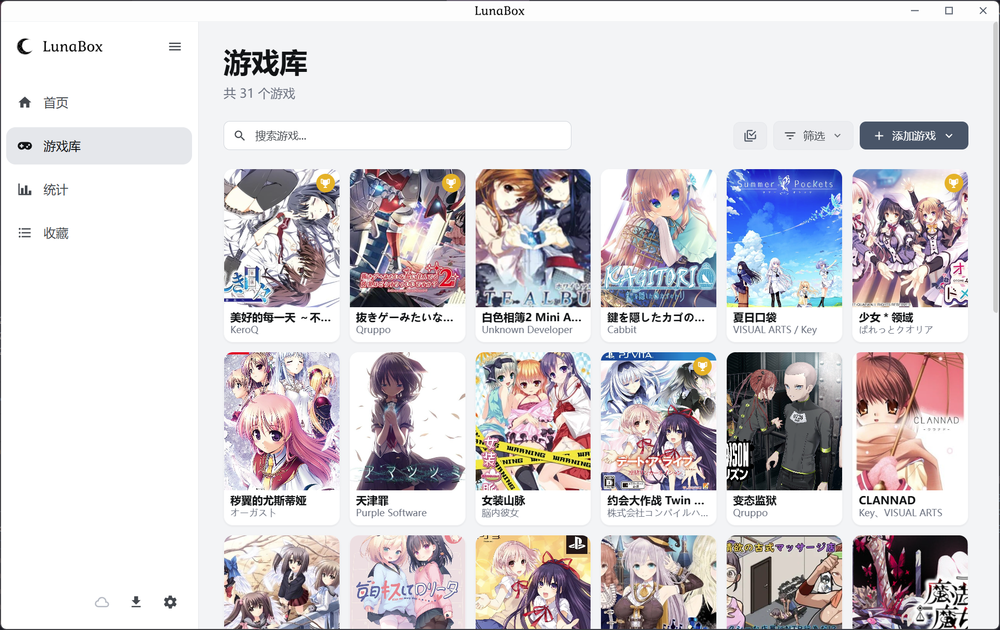
       
      Library
    </td>
    <td width="50%" align="center">
      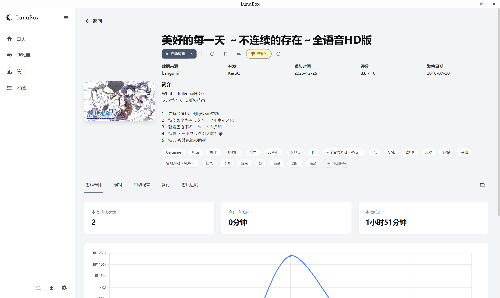
       
      Game Detail
    </td>
  </tr>
  <tr>
    <td colspan="2" align="center">
      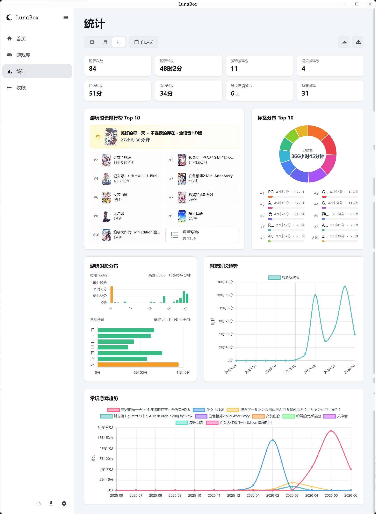
       
      Statistics
    </td>
  </tr>
</table>

## 📦 Installation

### Download from Releases

Go to the [Releases](https://github.com/Saramanda9988/LunaBox/releases) page and download the latest installer.

You can also download a Nightly build from [AutoBuild](https://github.com/Saramanda9988/LunaBox/releases/tag/dev-latest) to try the latest features.

## 🤝 Contributing

Issues and Pull Requests are welcome.

## 🗺️ Roadmap

- [ ] IM platform bot plugin
- [x] Multi-device synchronization
- [x] Expose MCP and provide link-based game launch capability for AI
- [ ] "What to play next" recommendation feature
- [ ] Support Linux/macOS platform
- [ ] Support Korean/Traditional Chinese and other languages

## 😀 From Open Source to Open Source

Inspiration:

- [PotatoVN](https://github.com/GoldenPotato137/PotatoVN) - Galgame 管理工具
- [ReinaManager](https://github.com/huoshen80/ReinaManager) - 一款轻量化的galgame和视觉小说管理工具
- [Playnite](https://github.com/JosefNemec/Playnite) - An open source video game library manager with one simple goal: to provide a unified interface for all of your games
- [Vnite](https://github.com/ximu3/vnite) - A unified platform to organize your game collection, track gameplay, with real-time cloud sync across devices and detailed gameplay reports

## 🙏 Acknowledgements

Game metadata APIs:

- [Bangumi](https://github.com/bangumi) - Bangumi番组计划
- [VNDB](https://vndb.org/) - The Visual Novel Database
- [月幕gal](https://www.ymgal.games/) - 请感受这绝妙的文艺体裁
- [萌娘百科](https://zh.moegirl.org.cn/) - 万物皆可萌的百科全书
- [Steam](https://store.steampowered.com/) - The world's largest digital game distribution platform
- [TouchGal](https://www.touchgal.ink/) - A one-stop Galgame culture community
- [Hikarinagi](https://www.hikarinagi.org/) - An ACGN community for you and fellow fans

Archive extraction support:

- [7-Zip](https://www.7-zip.org/) - A free and open-source file archiver, a utility used to place groups of files within compressed containers known as "archives".

## 🙌 Sponsors

|  | Free code signing on Windows provided by [SignPath.io](https://about.signpath.io/product/open-source), certificate by [SignPath Foundation](https://signpath.org/). |
| --- | --- |

## 📄 License

This project is licensed under [AGPL v3](LICENSE).
